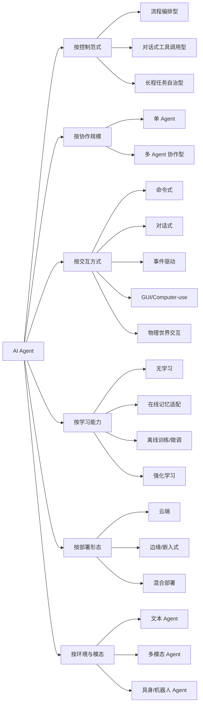
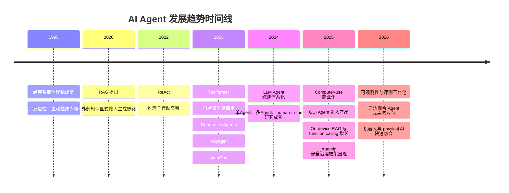

# 市面上 AI Agent 类型全景与技术路线深度研究报告

## 执行摘要

当前市面上的 AI Agent 并不是单一产品形态，而是从“预定义工作流”到“自主规划执行”，再到“多智能体协作”“GUI 操作”和“具身机器人”的连续谱系。对产品与研究人员而言，最关键的不是追逐“最强 Agent”名词，而是按任务开放度、可控性、交互方式、学习闭环、部署环境与安全要求来选型：结构化业务优先流程型，知识工作优先对话/工具型，复杂开放任务才值得上自治型或多智能体，强合规与低时延场景则应优先云边混合与可观测架构。citeturn15view0turn14view0turn26view5turn22view2

## 智能体的定义与分类框架

在经典人工智能语境中，智能体通常被定义为“感知环境并采取行动以实现目标”的系统；Wooldridge 与 Jennings 进一步强调自治性、反应性、主动性与社会性等属性。进入大模型时代后，OpenAI、AWS、Google、Anthropic 等厂商更强调智能体对**工具、状态、规划、协作与执行**的综合能力：它不仅回答问题，还能调用工具、访问外部系统、与其他专长代理协作，并在多步任务中保持足够状态。citeturn8search0turn8search1turn25search21turn26view5turn12view1turn15view6

从工程与市场视角看，“Agent 类型”至少应沿六个维度分类：一是**控制范式**，区分预定义工作流与动态自治；二是**协作规模**，区分单 Agent 与多 Agent；三是**交互方式**，包括命令式、对话式、事件驱动、GUI 驱动与物理世界交互；四是**学习能力**，区分无学习、基于记忆的在线适配、离线训练与强化学习；五是**部署形态**，区分云端、边缘/嵌入式与混合部署；六是**模态与环境**，区分文本、多模态、GUI 与具身场景。学术综述也普遍将现代 Agent 拆分为“脑/规划、感知、行动、记忆、反馈、环境、评测”等模块，而不是按单一行业来定义。citeturn35search0turn35search1turn35search2turn35search7

同一个商业产品往往横跨多个类别。例如，Anthropic 明确区分 **workflow** 与 **agent**：前者是预定义代码路径编排，后者则由模型动态决定过程与工具调用；Google 也把单 Agent、顺序型多 Agent、并行型、循环型、评审型等都视作不同设计模式，而不是彼此排斥的产品门类。因此，下面的“类型”更适合作为**主导范式**来理解，而非互斥标签。citeturn15view0turn14view0turn14view1

下图将市面主流 Agent 的分类关系抽象为一张“维度—类型”关系图，综合了经典智能体理论、LLM Agent 综述、Anthropic 的 workflow/agent 区分，以及 Google 的 agentic design patterns。citeturn8search0turn35search0turn15view0turn12view1

## 市场主流类型与能力画像

### 流程编排型 Agent

**简明定义**：流程编排型本质上是“带大模型节点的工作流系统”。控制逻辑主要由预定义步骤、分支、网关、顺序/并行/循环节点决定，LLM 只在局部承担分类、生成、抽取或判断。Anthropic 将这类系统明确归为 workflows；Google 也把顺序型、并行型、循环型等作为典型 workflow agent 设计模式。citeturn15view0turn14view2turn14view1

**关键特征**：可预测、可审核、可插入人工审批与规则校验，擅长处理高结构化流程。Dify 的 Workflow/Chatflow、Microsoft Copilot Studio 的 flows、CrewAI Flows 都把“节点编排、状态、触发器、日志与恢复”作为核心能力。Dify 甚至将触发器、用户输入、变量、MCP 发布与工作流统一在同一引擎下；Copilot Studio 则支持手动、自动事件或日程触发；CrewAI 强调事件驱动与长流程状态管理。citeturn23view2turn12view5turn30view2turn29search13

**代表产品/开源项目**：Dify Workflow/Chatflow、Microsoft Copilot Studio flows、CrewAI Flows、Google 的 sequential/parallel/loop workflow patterns。citeturn23view2turn12view5turn30view2turn14view2

**典型应用场景**：客服分流、表单审核、营销内容生成与翻译、审批流、规则驱动的数据处理、SaaS 集成自动化。Anthropic 以 prompt chaining、routing、parallelization 作为典型 workflow 模式；Google 则建议将结构化、重复性强、步骤相对稳定的问题优先建成顺序或并行工作流。citeturn15view2turn15view3turn15view4turn14view2

**优缺点分析**：优势是稳定、解释性强、上线快、成本可控；缺点是灵活性有限，面对开放问题、异常分支和不确定依赖时容易变得复杂而脆弱。Anthropic 明确建议先用最简单方案，只有在必要时才增加 agentic 复杂度。citeturn15view0turn14view2

### 对话式工具调用型 Agent

**简明定义**：这类 Agent 以对话为主要入口，由单个模型在对话中理解目标、选择工具、访问知识库并给出答案或执行结果。与工作流型相比，它的流程不是完全写死，而是让模型在限定工具集内做局部自治。citeturn26view5turn12view4turn12view6turn12view7

**关键特征**：核心能力通常包括函数调用、知识库/RAG、会话状态、工具目录和外部系统接入。OpenAI 将 Agent 定义为包装了模型、指令、工具、guardrails、MCP servers、handoffs 和 structured outputs 的核心单元；Anthropic 强调 tool use；Amazon Bedrock Agents 则把 action groups、knowledge bases 和 prompt templates 作为主要构件；Dify Agent、Coze 单 Agent 也都是“对话接入 + 工具执行”的典型产品形态。citeturn26view2turn19search7turn12view4turn12view6turn12view7

**代表产品/开源项目**：OpenAI Agents SDK 单 Agent、Amazon Bedrock Agents、Anthropic tool use、Dify Agent、Coze 单 Agent。citeturn26view5turn12view4turn19search7turn12view6turn12view7

**典型应用场景**：企业知识问答、运营助理、数据分析助手、客服与员工助手、个人办公助手。Copilot Studio 官方也将“销售支持、店铺信息、员工福利咨询、跨渠道客户/员工交互”等列为 Agent 的典型用途。citeturn12view5

**优缺点分析**：优势是用户体验自然、ROI 高、改造成本低；缺点是强依赖工具定义与知识质量，容易出现工具误用、检索偏差、上下文膨胀与幻觉问题。RAG 能引入显式非参数记忆并改善事实性与来源可溯性，但它本身不是“学习”，而是推理时的外部知识增强。citeturn7search1turn26view2turn19search7

### 长程任务自治型 Agent

**简明定义**：长程任务自治型面向开放问题与多步复杂任务，通常具备规划、迭代研究、文件与代码操作、后台执行、阶段性反思与自我修正能力。它不是简单“问答”，而是“持续工作直到交付物完成”。citeturn15view6turn18view2turn18view6turn32search0

**关键特征**：常见架构是 planner–executor、orchestrator–workers、reviewer–critic，以及带文件系统/沙箱/后台任务的 agent harness。OpenAI 的 ChatGPT agent 强调“now thinks and acts”，整合了网站操作、代码执行、分析、幻灯片与表格生成；NVIDIA AI-Q 的 Deep Researcher 通过多阶段、多子代理和迭代研究生成可发表风格报告；LangChain Deep Agents 则把任务规划、子代理生成、文件系统与长期记忆作为内建能力。citeturn18view2turn18view6turn32search0turn32search6

**代表产品/开源项目**：ChatGPT agent、NVIDIA AI-Q Deep Researcher、LangChain Deep Agents、Deep Agents Code。citeturn18view2turn18view6turn32search0turn32search6

**典型应用场景**：深度研究、竞争情报、长文报告、投研摘要、复杂数据整理、软件工程与代码修改。Anthropic 也指出 orchestrator-workers 适合复杂搜索与跨文件代码变更；其 evaluator-optimizer 模式则适合需要多轮评审打磨的内容任务。citeturn15view5turn15view6

**优缺点分析**：优势是能覆盖传统 chatbot 难以胜任的开放任务；缺点是时延高、成本高、失败链路更长，对权限边界、恢复机制、审批和可观测性要求更高。Anthropic 明确提醒，agentic systems 往往用更高的延迟和成本换取更高的任务完成度。citeturn15view0turn18view2

### 多智能体协作型 Agent

**简明定义**：多智能体协作型把复杂目标拆解给多个专长代理，由一个管理者、handoff 机制或图式编排层协调它们，共同完成任务。其核心不是“多模型并排跑”，而是带上下文隔离与角色分工的系统协作。citeturn14view1turn13view0turn26view1

**关键特征**：Google 将多 Agent 模式进一步细分为顺序、并行、循环、review-and-critique 等；OpenAI 则区分 handoffs 与 agents-as-tools；Microsoft AutoGen 强调“conversable agents”与多 Agent 会话；LangGraph 使用共享状态图和 Pregel 风格消息传递作为可靠执行底座；CrewAI 把 agents、crews、flows 集成为协作系统。citeturn14view1turn26view1turn13view3turn17view2turn30view2

**代表产品/开源项目**：Microsoft AutoGen、Google ADK、OpenAI handoffs/agents-as-tools、LangGraph、CrewAI、Coze 多 Agent。citeturn13view0turn12view2turn26view1turn17view1turn30view2turn12view7

**典型应用场景**：复杂企业流程、投研、代码工程、供应链分析、跨部门协同、需要多角色审校的内容生产。Google 明确指出，多 Agent 更适合单 Agent 难以管理的大目标与专业化子任务，并能提升可维护性与扩展性。citeturn14view1

**优缺点分析**：优势是模块化、可扩展、适合团队式复杂任务；缺点是通信开销、成本、权限划分与上下文工程难度明显上升。Google 也特别提醒，多 Agent 相较单 Agent 需要更精细的访问控制、可靠的编排层与额外评测治理。citeturn14view1turn13view2

### GUI 与 Computer-use 型 Agent

**简明定义**：这类 Agent 通过屏幕截图、视觉理解、鼠标键盘操作或浏览器控制与 GUI 系统交互，目标是打通没有 API 或 API 难以覆盖的系统。citeturn12view8turn27view3

**关键特征**：其技术栈一般是 VLM/多模模型 + 推理 + 行动接口 + 沙箱/虚拟机/浏览器 harness。OpenAI 的 computer use 工具允许模型通过 UI 操作软件，CUA 模型结合了 GPT-4o 视觉与强化学习推理；Anthropic 的 computer use 提供截图、鼠标、键盘和桌面自动化接口；Browser Use 提供浏览器自动化与 MCP server 形态。citeturn18view3turn18view4turn27view3turn9search15turn9search7

**代表产品/开源项目**：OpenAI Computer use / CUA、Anthropic Computer use、Browser Use。citeturn18view3turn12view8turn27view3turn9search15

**典型应用场景**：遗留系统录入、网页任务自动化、跨站点信息收集、测试与 QA、低 API 可用性的运营流程。OpenAI 公开给出的场景包括 web QA 与 legacy system data entry；Anthropic 则聚焦 autonomous desktop interaction。citeturn18view4turn27view3

**优缺点分析**：优势是覆盖范围广，能把“人能点的界面”纳入自动化；缺点是速度慢、对 UI 变更敏感、易受 prompt injection 与会话劫持影响，且必须运行在隔离沙箱中。Anthropic 与 MCP 官方都把 prompt injection、代理权限滥用、session hijacking、SSRF 等列为重点风险。citeturn27view3turn27view2turn13view9

### 具身与机器人型 Agent

**简明定义**：具身 Agent 直接在物理世界感知、规划与执行动作，典型形态是机器人“大脑”或 vision-language-action 系统。它把 Agent 的“act”从 API 和 GUI 扩展到空间与机械控制。citeturn31search0turn31search5turn31search3

**关键特征**：常见技术包括视觉—语言—动作模型、空间推理、策略学习、数字孪生仿真、sim-to-real 和强化学习。Google DeepMind 的 Gemini Robotics 强调感知、推理、工具使用与多步计划；Gemini Robotics On-Device 强调本地运行；NVIDIA Isaac/GR00T 则提供机器人基础模型、仿真、数据与部署平台；Voyager 则展示了 LLM 驱动具身智能体在 Minecraft 中的终身学习能力。citeturn31search0turn31search5turn31search8turn31search3turn31search2turn6search1

**代表产品/开源项目**：Gemini Robotics、Gemini Robotics On-Device、NVIDIA Isaac/Isaac GR00T、Voyager。citeturn31search0turn31search5turn31search3turn31search2turn6search1

**典型应用场景**：仓储抓取、巡检、制造、服务机器人、人形机器人研发、复杂操作技能迁移。NVIDIA 将 Isaac 平台定位为 AMR、机械臂、操纵器与人形机器人的统一开发底座。citeturn31search3turn31search7

**优缺点分析**：优势是直接连接生产力与物理世界；缺点是安全门槛最高，对低时延、鲁棒性、训练数据、仿真精度与责任边界要求远高于纯软件 Agent。NVIDIA 明确把强化学习和仿真视为 physical AI 的关键训练方式。citeturn31search4turn31search12turn31search19

## 技术实现与关键设计取舍

现代 Agent 的通用架构，已经从“一个 prompt + 一个模型”演进为由**角色/目标（profile）—记忆（memory）—规划（planning）—行动（action）—反馈（feedback）—环境（environment）**构成的模块化系统。多篇综述都给出了近似统一的框架：Wang 等把 LLM Agent 拆成 profile、memory、planning、action；Xi 等把它描述为 brain、perception、action；近年的 agentic LLM survey 又进一步补充了 learning、evaluation 和 environment 维度。citeturn35search0turn35search1turn35search2turn35search7

在关键算法层面，**ReAct** 把推理与行动交替编排，是今天单 Agent/多 Agent 调用工具的基础模式之一；**Toolformer** 说明模型可以通过自监督方式学习“何时调用什么 API”；**Reflexion** 把语言反馈写入记忆，从而在不更新权重的前提下实现“verbal reinforcement learning”；**RAG** 把显式外部知识接入生成链路，解决世界知识更新和来源追溯问题。工程上，LangGraph 用共享状态图与 Pregel 风格消息传递实现可恢复、可并行、可中断的人在环工作流，这也是很多生产系统比“纯 prompt agent”更稳定的原因。citeturn5search0turn6search0turn5search2turn7search1turn17view1turn17view2

工具接入已从早期的“函数调用”扩展为更通用的上下文与工具协议。Anthropic 的 tool use、OpenAI 的 tools/guardrails/MCP servers，以及 MCP 官方规范都指向同一趋势：Agent 不是封闭模型，而是**通过标准接口连接数据源、工具与业务流程**。MCP 将自己定义成连接 AI 应用与外部系统的“USB-C”，这对复杂企业集成尤其重要。citeturn19search7turn26view2turn13view7

在**交互方式**上，命令式最常见于 CLI/编码代理；对话式仍是商业化最主流入口；事件驱动适合流程平台和企业自动化；GUI 驱动覆盖 web/desktop；具身交互则进入传感器与执行器闭环。Dify 的工作流支持按用户输入或外部触发器启动，Copilot Studio 的 flows 支持手动、自动事件和日程触发，OpenAI/Anthropic 的 computer use 则把截图与鼠标键盘纳入交互介质，Gemini Robotics 则强调机器人对自然命令和环境变化的响应。citeturn23view2turn12view5turn12view8turn27view3turn31search10

在**学习能力**上，市面 Agent 可以分成四档。第一档是**无学习**：只靠固定提示词、工具与规则运行。第二档是**在线轻量适配**：通过短期/长期记忆写入、用户画像、语义记忆或反思文本来改进未来表现，但不改模型权重；LangMem、Reflexion 都属于这一类。第三档是**离线训练/微调**：通过 SFT、偏好优化、奖励模型或知识构建改进 agent backbone 或周边组件。第四档是**强化学习**：尤其常见于 GUI/物理环境中，OpenAI 的 CUA 明确结合了强化学习，NVIDIA 也把 RL 视作 physical AI 的关键训练机制。需要特别强调：RAG、知识库和缓存通常属于“推理增强”而不是“真正学习”。citeturn16search5turn16search3turn16search14turn16search16turn5search2turn18view3turn31search4

在**部署形态**上，云端仍是主流，因为它便于访问大模型、集中治理与弹性扩展。Google 的 Gemini Enterprise Agent Platform、Amazon Bedrock Agents、OpenAI Agents SDK 都明显面向云端或服务端编排。与此同时，边缘/嵌入式正在快速增长：Gemini Nano 运行在 Android AICore 中，强调低时延与本地隐私；Google AI Edge 已支持 on-device RAG 与 function calling；Jetson Orin Nano 明确面向多模态 agents 等边缘工作负载；Qualcomm AI Hub 则提供设备侧模型优化与部署流水线。更值得注意的是**混合架构**：Google ADK for Android 已展示“云端 orchestrator + 端上检索子代理”的模式，把敏感数据留在本地，把复杂推理留在云端。citeturn13view5turn12view4turn26view5turn12view9turn28view3turn28view2turn28view4turn28view1

在**可解释性**上，当前业界的可解释方案更多是“工程可追溯”，而不是“模型内部机制透明”。主流手段包括：来源引用、工具调用轨迹、handoff 记录、状态图、执行 trace、评测与在线监控。Anthropic 支持文档 citations，并在 web search 返回带来源的答案；OpenAI Agents SDK 默认支持 tracing，记录模型调用、工具调用、handoff 与 guardrails；LangSmith 和 Google Agent Platform 都把 tracing、observability 与 evaluation 做成平台能力。citeturn27view0turn27view1turn26view0turn19search17turn19search11turn19search9turn19search12

在**安全性**上，Agent 明显比“只生成文本”的系统更复杂。NIST 的 GenAI 风险管理框架强调要在设计、开发、使用和评估全生命周期纳入可信性治理；OWASP 的 Agentic Applications Top 10 已把自治型系统的关键风险单列出来；MCP 官方安全文档则点名 confused deputy、token passthrough、SSRF、session hijacking、scope minimization 等问题。OpenAI 与 Anthropic 都在产品级引入 guardrails、人类审批与 prompt injection 防护。对于企业来说，安全不是上线后的补丁，而是 Agent 架构本身的一部分。citeturn13view8turn13view9turn27view2turn26view3turn27view3

下表将六类主流 Agent 放到同一比较框架中，以便从技术、部署、交互和适用场景角度快速判断选型。

| 类型 | 简明定义 | 典型架构与关键技术 | 交互方式 | 学习能力 | 常见部署 | 代表产品/开源 | 适用场景 | 主要优点 | 主要缺点 |
|---|---|---|---|---|---|---|---|---|---|
| 流程编排型 | 预定义控制流中嵌入 LLM 能力 | 顺序/并行/循环节点、规则网关、变量、触发器、RAG/函数调用 | 命令式、事件驱动 | 多数无权重学习，可带会话变量 | 云端、私有化、混合 | Dify Workflow/Chatflow、Copilot Studio flows、CrewAI Flows、Google workflow patterns citeturn23view2turn12view5turn30view2turn14view2 | 审批流、客服分流、业务自动化 | 可控、易审计、成本低 | 灵活性不足，遇到开放问题易爆炸式复杂 |
| 对话式工具调用型 | 单 Agent 在对话中理解目标并调用工具 | 单 Agent + tools + KB/RAG + state + MCP | 对话式为主 | 以状态与记忆适配为主 | 云端、SaaS、企业私有云 | OpenAI Agents SDK、Bedrock Agents、Dify Agent、Coze、Anthropic tool use citeturn26view5turn12view4turn12view6turn12view7turn19search7 | 企业知识助手、办公助手、客服 | 上手快、体验自然、ROI 高 | 幻觉、误用工具、上下文膨胀 |
| 长程任务自治型 | 面向开放目标，持续规划、研究、执行直到交付 | planner-executor、orchestrator-workers、长期记忆、沙箱/文件系统 | 对话式、命令式、后台任务 | 在线记忆适配，部分结合离线评测/优化 | 云端、容器、沙箱 | ChatGPT agent、NVIDIA AI-Q、Deep Agents、Deep Agents Code citeturn18view2turn18view6turn32search0turn32search6 | 深度研究、长文报告、复杂分析、编码 | 能处理开放复杂任务 | 时延高、成本高、恢复难度大 |
| 多智能体协作型 | 多个专长代理在编排层协调下完成大目标 | handoff、agents-as-tools、状态图、manager-worker、reviewer-critic | 对话式、命令式、事件驱动 | 可结合在线记忆与多代理反馈 | 云端、私有化、混合 | AutoGen、Google ADK、LangGraph、CrewAI、OpenAI handoffs、Coze 多 Agent citeturn13view0turn12view2turn17view1turn30view2turn26view1turn12view7 | 复杂企业流程、投研、代码工程 | 模块化、可扩展、利于专业分工 | 成本高、调试难、权限治理复杂 |
| GUI/Computer-use 型 | 通过屏幕和动作操作软件/网页 | VLM + 推理 + 鼠标键盘/浏览器 harness + 沙箱 | GUI 驱动 | 常见结合 RL 或环境反馈 | 云端控制 + 沙箱/VM，本地浏览器也可 | OpenAI computer use/CUA、Anthropic computer use、Browser Use citeturn18view3turn27view3turn9search15 | 遗留系统、网页任务、QA、数据录入 | 覆盖无 API 系统，自动化边界大 | 慢、脆弱、注入风险高 |
| 具身/机器人型 | 在物理世界感知、计划并执行动作 | VLA/VLM、空间推理、策略学习、仿真、RL、sim-to-real | 多模态、物理交互 | 强化学习与离线训练占比高 | 边缘、嵌入式、混合 | Gemini Robotics、Gemini Robotics On-Device、NVIDIA Isaac/GR00T、Voyager citeturn31search0turn31search5turn31search3turn31search2turn6search1 | 仓储、制造、巡检、服务机器人 | 直接连接物理生产力，多模态能力强 | 安全门槛高、硬件成本高、工程复杂 |

## 代表产品与开源生态对比

如果从“平台能力”而不是“类型”来看，当前生态大致可以分为四层。第一层是**模型与官方 Agent 平台**：OpenAI Agents SDK 强调 code-first orchestration、guardrails、state、sandbox 与 tracing；Anthropic 强调简单可组合的 agent patterns、tool use、citations 与 computer use；Google 提供 ADK、Agent Platform、评测与可观测性，并开始把 on-device Agent 延伸到 Android；AWS Bedrock Agents 则把基础模型、action groups、knowledge bases 与 prompt templates 打包成企业托管服务。citeturn26view5turn26view0turn15view0turn27view0turn27view3turn12view2turn13view5turn19search12turn12view4

第二层是**企业低代码与应用构建平台**。Microsoft Copilot Studio 明确定位为 low-code agent and agent flows 工具；Dify 则强调 agentic app building，可经 API、Web 或 MCP server 访问，也支持 Agent、Workflow、Chatflow 等多种应用形态；Coze 以“通过对话开发和部署智能体”为核心体验，既支持单 Agent，也支持多 Agent 与 API 发布。面向希望快速验证场景、但不想从头写编排代码的团队，这一层通常是最现实的起点。citeturn12view5turn23view2turn12view6turn23view3turn12view7turn10search17

第三层是**开源编排与开发框架**。AutoGen 主打多 Agent 会话与合作；LangGraph 主打基于图和共享状态的可靠执行；Deep Agents 主打长程任务、文件系统、子代理与记忆；CrewAI 则把 agents、crews、flows、guardrails、memory、knowledge、observability 集成为一个更“产品化”的开源框架。对于研究人员和平台团队，这一层比“黑盒 SaaS”更适合做深度定制。citeturn13view0turn13view3turn17view1turn17view2turn32search0turn32search6turn30view2

第四层是**垂直参考实现与端侧/物理世界平台**。NVIDIA AI-Q 把 deep research 做成参考蓝图；Browser Use、OpenAI computer use、Anthropic computer use 把 GUI 自动化做成通用操作面；Jetson、Qualcomm AI Hub、Android AICore/Gemini Nano 把 Agent 拉向边缘与嵌入式；Gemini Robotics 与 Isaac/GR00T 则进一步延伸到具身智能。换句话说，Agent 生态正在从“问答软件”变成“执行系统基础设施”。citeturn13view6turn18view6turn9search15turn18view3turn27view3turn12view9turn28view4turn28view2turn31search0turn31search2

从选型角度看，若你是**产品团队**，通常应优先考虑：是否需要低代码快速上线、是否必须私有化、是否需要多 Agent、是否需要 GUI 操作、是否要保留用户数据在端侧。若你是**研究/平台团队**，则更应关注状态管理、评测、trace、权限系统、工具协议、沙箱与恢复机制。Google、OpenAI、LangChain、CrewAI 都把 observability 和 evaluation 提升到了与“建 Agent”同等重要的地位，这说明 Agent 工程正在走向成熟的软件工程范式。citeturn19search9turn19search12turn26view0turn32search14turn30view2

## 应用场景、行业案例与趋势判断

在**政务与公共服务**领域，智能体已经从“问答机器人”演进到“问答—引导—即办—预审—多渠道协同”的全链路引擎。中国信通院《政务智能体发展研究报告》中的广西案例显示，政务服务智能体通过统一知识体系、知识图谱、规则引擎与多渠道 API 集成，将政务服务事项规范统一为 4133 项，办理材料减少 461 项、办事环节减少 1122 项；而“蒙速办”案例则引入 RAG、奖励模型、CoT、多模型融合和三层安全防控，实现 7×24 小时服务，并将千条评测集人工标注与归因成本从 20 人天降至 4 人天。citeturn22view1turn34view3turn34view4turn34view5

这些案例也说明，真正产生价值的政务 Agent 往往不是“一个万能模型”，而是**知识中枢 + 业务规则 + 大模型决策 + 多渠道接入 + 安全审计**的复合系统。信通院还明确把政务智能体部署模式分为 SaaS、API 嵌入与定制化服务三种，这与企业场景中的云服务、嵌入式集成和私有化定制高度一致。citeturn34view5turn22view3

在**软件工程与知识工作**领域，长程任务自治型和多智能体系统增长最快。Anthropic 公开表示，其实现已经能够基于 PR 描述解决 SWE-bench Verified 上的真实 GitHub issue；SWE-bench 则已成为衡量软件工程 Agent 的标准基准之一。OpenAI 的 ChatGPT agent 直接把竞品分析、日程查阅、资料搜集、幻灯片与表格交付作为目标场景；LangChain Deep Agents Code 与 OpenHands 一类工程代理，则把终端、文件系统、记忆和审批控制做成了长期工作环境。citeturn15view1turn20search10turn20search20turn18view2turn32search6turn32search1

在**移动端、边缘与嵌入式**领域，趋势非常明确：不是所有 Agent 都要上云。Android 官方已把 Gemini Nano、AppFunctions、Android Computer Control 和本地 agentic intelligence 作为重点方向；Kakao Mobility 的案例显示，基于端侧 Gemini Nano 的地址输入与辅助能力在降低服务器成本的同时，也提升了完成时间与转化表现。Google 还展示了“云编排 + 端侧子代理”的混合模式：云端负责 user-facing reasoning，本地负责读取私有文档与执行检索分析。citeturn28view0turn12view9turn28view1

在**机器人与 physical AI**领域，Agent 正从数字世界走向真实环境。Gemini Robotics 描述的是能感知、推理、使用工具并与人类互动的机器人模型；Gemini Robotics On-Device 说明这一能力已开始本地化；NVIDIA Isaac/GR00T 则把基础模型、仿真、学习与机器人开发平台结合起来。这里的核心难题不再只是“回答得对不对”，而是“是否能安全、稳定、低时延地完成物理动作”。citeturn31search0turn31search5turn31search3turn31search2turn31search14

从研究发展看，Agent 的评测重心正从静态问答转向**端到端任务完成**。GAIA 强调真实世界问题需要推理、多模态、浏览和工具使用；OSWorld 提供真实计算机环境；WebArena 评测自主 web agents；SWE-bench 衡量软件问题修复能力。对产品团队而言，这意味着未来选型不能只看“模型基准分”，而要看具体场景上的任务完成率、恢复能力、成本与风险暴露。citeturn20search0turn20search1turn20search2turn20search10turn35search17

下面的时间线概括了 Agent 近年的关键演进节点，综合了经典智能体理论、RAG、ReAct/Toolformer/Reflexion 等关键论文，以及近两年官方平台在 computer use、评测、可观测性、端侧和具身智能上的推进。citeturn8search0turn7search1turn5search0turn6search0turn5search2turn26view5turn27view3turn28view1turn31search0

未来三到五年，最可能成为主流的不是“一个超级通用 Agent”，而是三条并行路线。第一条是**企业流程型 Agent**，把 Agent 变成业务系统的编排层；第二条是**知识工作型长程 Agent**，把研究、分析、写作、编码做成后台执行服务；第三条是**云边混合与具身 Agent**，在端侧保护隐私、在云端做复杂推理、在物理世界完成执行。与此同时，MCP、AppFunctions、trace、grader、evaluation suite 和安全基线会越来越像今天微服务世界里的 API Gateway、APM 与 DevSecOps。citeturn13view7turn28view0turn26view0turn19search12turn27view2turn31search7

## 结论与建议

如果只问“市面上有哪些 Agent”，答案会非常混乱；如果换成“按什么标准分类、适合什么任务、代价是什么”，市场就会清晰得多。总体上，可以把今天主流 Agent 看成六类：流程编排型、对话式工具调用型、长程任务自治型、多智能体协作型、GUI/Computer-use 型、具身/机器人型。它们的本质差异不在营销口号，而在**自治程度、环境复杂度、交互介质、学习闭环和治理成本**。citeturn15view0turn14view0turn35search2

对产品团队，建议采用“三步法”。第一步，先判断问题是不是**高结构化、低开放度**；若是，优先工作流/流程型。第二步，只有在任务依赖动态检索、工具选择和上下文保持时，才升级到单 Agent 对话式工具调用。第三步，只有当任务本身开放、复杂、长程、角色分工明显，才值得投入多 Agent、computer-use 或长程自治架构。Anthropic 和 Google 的官方建议都指向同一个原则：**先从最简单的、最可控的系统开始，而不是一上来就做复杂自治体。**citeturn15view0turn12view1

对研究与平台团队，建议把重点放在四个方向。第一，**状态与记忆工程**，因为长程任务质量往往受限于状态压缩、上下文切片和持久记忆，而不只是模型尺寸。第二，**评测与可观测性**，因为没有 trace、grader 和线上监控，复杂 Agent 很难持续迭代。第三，**安全边界与权限治理**，尤其是 GUI Agent、MCP 接入和企业多 Agent 的越权问题。第四，**云边混合与多模态执行**，这是从“会说”走向“能做”的真实分水岭。citeturn16search3turn16search5turn26view0turn19search12turn27view2turn28view1turn31search0

最后，用一句话概括本报告的判断：**Agent 不是聊天机器人的升级版，而是在大模型、工具、记忆、状态、评测和执行环境之上形成的新型软件系统。** 未来竞争力不只取决于基础模型能力，更取决于谁能把分类清晰、架构稳健、风险可控、部署灵活、评测闭环的 Agent 系统真正落到业务和场景中。citeturn26view5turn13view8turn19search9turn22view2