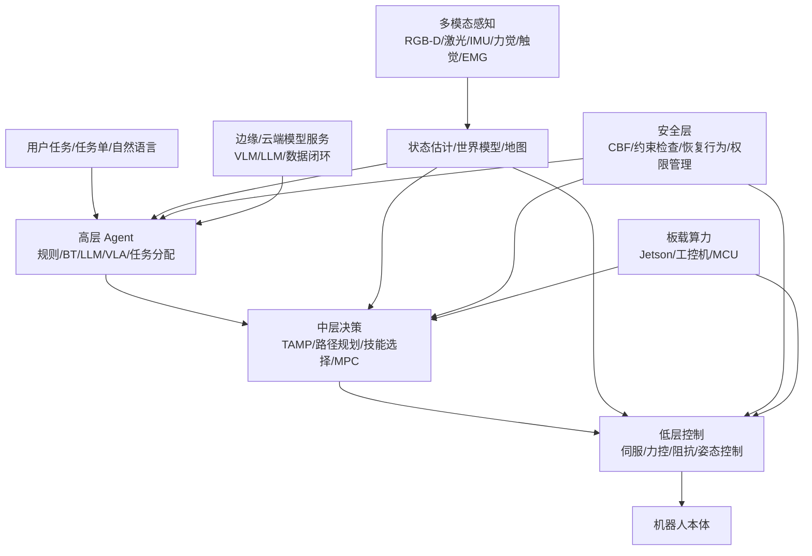
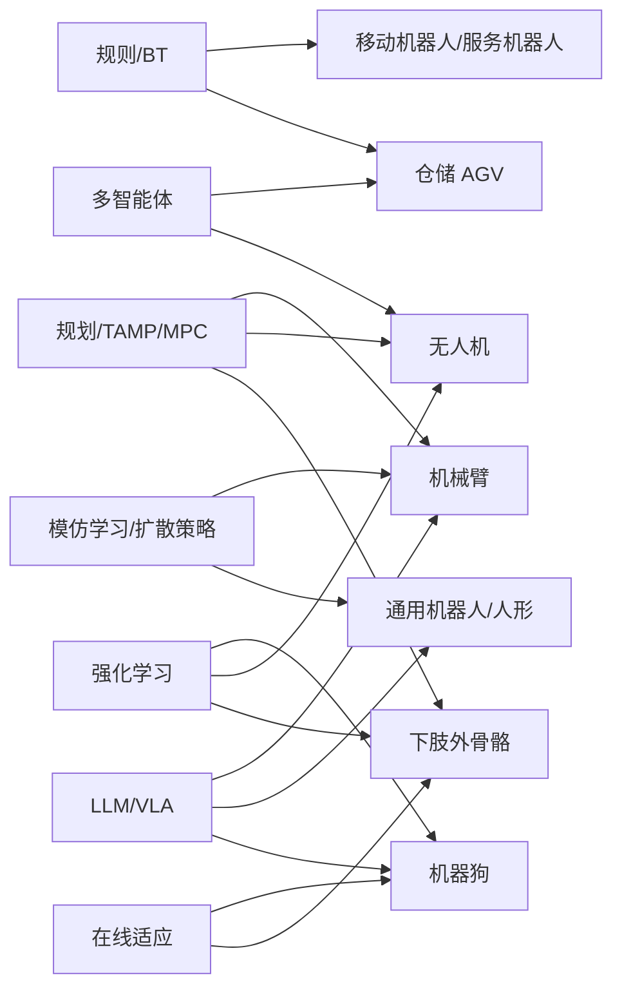

# 机器人 Agent 类型与跨平台应用深度研究报告

## 执行摘要

当前机器人 agent 的主流形态不是单一范式，而是“规则/规划/学习/大模型”分层混合：低层仍以 MPC、伺服与安全滤波为骨架，高层正快速引入 RL、模仿学习、VLA 与多智能体协同。机械臂最先受益于 IL/VLA，四足与外骨骼更依赖 sim2real 与在线适应，无人机和 AGV 仍以模型化与可验证性为工程主线。citeturn8search0turn10search1turn25search1turn24search3turn5search0

## 研究框架与核心判断

在机器人语境中，agent 更适合理解为“闭环决策体”：它接收感知与状态估计，选择高层任务、技能或动作，再由运动规划与低层控制执行；因此，市场上真正落地的系统通常是**分层混合架构**，而不是纯规则、纯强化学习或纯大模型。Nav2 明确使用行为树编排多个导航服务器；SayCan 把语言模型与技能价值函数组合起来；NaVILA 将 VLA 的高层语言决策与实时运动策略解耦；acados、PX4 与 Crocoddyl 则反映出低层仍高度依赖实时优化与模型化控制。citeturn8search0turn8search16turn8search6turn4search3turn10search1turn10search0turn6search10

下面的控制层级图是基于上述公开系统抽象出来的“主流工业/研究共识”：

这一抽象与 Nav2 的 BT 编排、Open-RMF 的车队调度、SayCan/RT-2/NaVILA 的高低层解耦、以及 acados/PX4 的实时控制路线一致。citeturn8search0turn8search5turn8search6turn25search1turn4search3turn10search1turn6search10

## Agent 类型谱系与技术比较

严格说，这些类别彼此重叠。例如 OpenVLA 既是 VLA/LLM 驱动 agent，也属于学习式控制器；SayCan 同时属于 LLM agent 与符号/混合系统；RMA 既是强化学习 agent，又是在线自适应 agent。更实用的做法不是问“哪一类最好”，而是问“哪一层最适合由哪一类 agent 主导”。citeturn24search3turn8search6turn5search0

| Agent 类型 | 定义与典型算法/框架 | 优点 | 局限 | 代表性开源项目或商用产品 |
|---|---|---|---|---|
| 基于规则 / 状态机 / 行为树 | 通过 FSM、BT、规则库、恢复树显式描述条件-动作逻辑；典型框架包括 BehaviorTree.CPP、Nav2 BT Navigator。citeturn1search1turn1search4turn8search0turn8search20 | 可解释、可维护、易验证，适合流程稳定任务。citeturn1search4turn8search16 | 泛化差，规则爆炸，面对开放环境扩展成本高。citeturn1search4turn13search2 | BehaviorTree.CPP；Nav2；Spot GraphNav/Autonomy SDK。citeturn1search1turn8search0turn23search8turn23search12 |
| 基于规划 agent | 显式搜索任务序列或轨迹；常见有 A*、RRT/OMPL、TAMP、PDDL、MTC、PDDLStream、ROSPlan。citeturn1search8turn1search15turn17search0turn10search3turn13search8 | 对几何/约束敏感、可加入可达性与碰撞检查，适于长时序任务。citeturn1search13turn17search0turn13search11 | 任务/场景建模成本高，感知不确定性下脆弱，复杂场景求解慢。citeturn17search0turn13search11 | MoveIt Task Constructor；PDDLStream；ROSPlan。citeturn1search13turn17search0turn10search3 |
| 强化学习 agent | 通过与环境交互最大化奖励；典型算法 PPO、SAC、TD3、Actor-Critic。Isaac Lab、legged_gym 是常用训练基座。citeturn11search9turn11search13turn4search2 | 可学出复杂接触、动态平衡和高维控制策略，四足/无人机/外骨骼收益显著。citeturn5search0turn21search1turn6search2turn7search11 | 奖励设计困难、样本成本高、安全性与可解释性弱，真实部署常需 sim2real。citeturn5search0turn12search0turn4search2 | Isaac Lab；legged_gym；RMA；DreamWaQ。citeturn11search9turn4search2turn5search0turn21search1 |
| 模仿学习 agent | 由示教数据学习策略，常见 BC、DAgger、ACT、离线 IL；robomimic、LeRobot 是核心生态。citeturn1search2turn1search5turn11search0turn14search4 | 数据效率高于纯 RL，易利用人类示教，首先在机械臂和移动操作中成熟。citeturn1search2turn14search4turn8search7 | 分布偏移会导致误差累积，对示教质量与覆盖度敏感。citeturn14search4turn1search2 | robomimic；ALOHA/ACT；Mobile ALOHA；LeRobot。citeturn1search2turn14search1turn8search3turn11search0 |
| 基于模型 agent | 使用动力学/接触/约束模型进行在线优化；典型为 MPC、DDP/FDDP、MPPI、MHE。citeturn10search1turn10search0turn10search6 | 实时性强、行为稳定、约束和安全边界容易写入，适合无人机、外骨骼、AGV。citeturn10search1turn10search13turn6search10 | 依赖模型质量，接触复杂或高度非线性任务的建模成本高。citeturn10search0turn10search1 | acados；Crocoddyl；Nav2 MPPI；PX4。citeturn10search1turn10search0turn10search6turn6search10 |
| 基于学习的控制器 | 直接将观测映射到动作，可由 RL、IL、蒸馏、生成模型训练；代表为 Diffusion Policy、学生策略、VLA 控制器。citeturn15search2turn7search4turn24search3 | 端到端闭环，尤其适合视觉-动作耦合与接触丰富任务。citeturn15search2turn21search2 | 调试困难，安全边界不透明，对数据和算力需求高。citeturn15search2turn12search0 | Diffusion Policy；OpenVLA；Octo；robust exoskeleton student policy。citeturn15search2turn24search3turn24search5turn7search4 |
| 多智能体协同 agent | 处理任务分配、通信、避碰、队形与协作；常见 MAPF、拍卖、MARL。citeturn16search0turn16search1turn9search3 | 适合车队、仓储、集群无人机与多机器人系统。citeturn8search5turn9search11turn22search0 | 通信与全局最优难兼顾，规模上升后计算与鲁棒性压力大。citeturn16search3turn9search3 | Open-RMF；free_fleet；MARLlib；PettingZoo。citeturn8search5turn16search2turn16search0turn16search1 |
| 基于符号 / 混合系统 | 将符号规划、行为树、技能库、学习策略和几何检查结合；典型如 PDDLStream、ROSPlan、SayCan、VoxPoser。citeturn17search0turn10search3turn8search6turn14search5 | 兼顾可解释性与开放词汇能力，是当前长时序机器人任务最现实路线。citeturn8search6turn14search5turn13search11 | 接口复杂，系统集成成本最高，错误可能跨层传播。citeturn13search11turn8search6 | PDDLStream；ROSPlan；SayCan；VoxPoser。citeturn17search0turn10search3turn8search6turn14search5 |
| LLM / VLA 驱动 agent | 用 LLM/VLM/VLA 做语义理解、任务分解、技能选择或直接生成动作；代表有 PaLM-E、RT-2、OpenVLA、Gemini Robotics、GR00T、π0。citeturn14search3turn25search1turn24search3turn18search1turn18search0turn18search15 | 通用性、语言交互、多任务迁移能力强，是通用机器人方向的核心增量。citeturn25search1turn24search3turn18search15 | 时延、可验证性、数据闭环、动作鲁棒性仍是主要短板。citeturn19search1turn12search0turn13search10 | PaLM-E；RT-2；OpenVLA；Gemini Robotics；Isaac GR00T；openpi/π0。citeturn14search3turn25search1turn24search3turn18search1turn18search0turn18search12 |
| 自适应 / 在线学习 agent | 在线估计隐变量、参数更新、快速后适应或边运行边优化；典型例子是 RMA、外骨骼轨迹自适应、在设备微调。citeturn5search0turn20search9turn19search1 | 对地形、载荷、个体差异和设备老化更鲁棒。citeturn5search0turn20search9turn7search4 | 稳定性与安全验证困难，在线探索空间必须被强约束。citeturn12search0turn12search16 | RMA；Online Reference Trajectory Adaptation；Gemini Robotics On-Device；OpenSourceLeg。citeturn5search0turn20search9turn19search1turn7search2 |

从“市面上可落地”的角度看，**规则/规划/模型控制并没有被大模型替代**。相反，主流趋势是：高层 increasingly 用 LLM/VLA 做语义决策，中层用 TAMP/MPC/技能库做可执行化，低层继续由实时控制器和安全层把关。Gemini Robotics On-Device、GR00T、π0/openpi 与 OpenVLA 的出现，说明产业界在加速把大模型压缩到可部署形态；但 PX4、acados、Nav2 与 Open-RMF 的活跃度也说明工程落地仍离不开传统机器人软件栈。citeturn19search1turn18search0turn18search12turn24search3turn6search10turn10search1turn8search0turn8search5

## 平台维度的应用、控制架构与实现案例

下图给出 agent 类型与平台的高适配映射。它不是排他关系，而是表示“当前最常见、成功案例最多”的组合：

这一映射对应的公开案例包括：机械臂上的 ALOHA、Diffusion Policy、OpenVLA；四足上的 legged_gym、RMA、NaVILA；服务机器人上的 Nav2、Open-RMF、SayCan；无人机上的 PX4、Agilicious 和高机动飞行策略；外骨骼上的 RL/轨迹自适应控制。citeturn14search1turn15search2turn24search3turn4search2turn5search0turn4search3turn8search0turn8search5turn8search6turn6search10turn6search0turn20search9

| 平台 | 主要应用场景 | 常见控制架构 | 感知/状态估计与学习方法 | 安全、实时性与部署 | 代表论文/工业/开源案例 |
|---|---|---|---|---|---|
| 机械臂 / 双臂 | 抓取、装配、分拣、桌面操作、厨房任务。citeturn15search2turn14search4turn24search3 | 低层是伺服、阻抗/力控；中层是轨迹优化与抓取生成；高层是技能序列或语言条件策略。MoveIt Task Constructor 用多阶段任务规划；VoxPoser/RT-2/OpenVLA 可将语言映射到技能或动作。citeturn1search15turn14search5turn25search1turn24search3 | 典型传感器为 RGB-D、腕力、夹爪状态；学习上以 IL、扩散策略、跨平台预训练为主，配合少量下游微调。Open X-Embodiment、Octo、OpenVLA 把跨机器人经验迁移到新机械臂。citeturn11search1turn24search5turn24search3 | 实时约束主要在末端闭环与接触控制；高层 VLA 通常需要边缘 GPU 或混合部署。Gemini Robotics On-Device、π0/openpi 体现出向本地部署收敛的趋势。citeturn19search1turn18search12turn18search6 | Diffusion Policy（2023，Columbia/MIT/Stanford）— 用动作扩散实现强闭环视觉操作；ALOHA/ACT（2023，Stanford）— 低成本双臂示教与 chunked action imitation；OpenVLA（2024，CoRL）— 开源 7B VLA，多机器人可微调；Octo（2024，RSS）— 通用开源 manipulation policy。citeturn15search2turn14search4turn24search3turn24search5 |
| 下肢外骨骼 | 康复训练、步态辅助、坐站训练、个体化辅助。citeturn7search20turn7search15 | 常见是“低层关节/阻抗控制 + 中层轨迹生成/步态相位估计 + 高层模式切换”。仍以混合式为主，而非完全端到端。citeturn20search9turn7search25turn7search13 | 关键感知是关节编码器、足底力、IMU、交互力矩，部分系统引入 EMG。学习方法包括 RL、在线轨迹自适应、教师-学生蒸馏。citeturn7search11turn7search4turn20search9 | 这是最强调安全与可解释性的场景之一，因为 human-in-the-loop、跌倒风险与法规约束都很高。工程上更偏好“学习增强的混合控制”，而不是自由探索的在线 RL。citeturn12search0turn7search3 | Luo et al.（2021，Frontiers）— RL 控制下肢康复外骨骼完成协作深蹲；Luo et al.（2023，JNER）— 深度 RL 实现鲁棒步行控制；Luo et al.（2025，JNER）— 最小传感器 + teacher-student DRL；Shushtari et al.（2021，RA-L）— 在线参考轨迹自适应；Open-Source Leg（Michigan）— 开源可复现实验平台。citeturn7search25turn7search11turn7search4turn20search9turn7search2turn7search12 |
| 机器狗 / 四足 | 巡检、复杂地形通行、搜救、巡逻、轻量操控。citeturn23search2turn23search4 | 低层常为力矩/足端控制；中层是步态生成或 MPC；高层是导航/巡检任务。研究界最成功的路线是 sim2real RL，再在高层叠加视觉或语言导航。citeturn4search2turn5search0turn21search2turn4search3 | 以本体感觉为主，视觉/深度相机为增量；学习方法高度依赖域随机化、扰动训练、随机推挤、质量/摩擦随机化。legged_gym 明确集成了这些 sim2real 技术。citeturn4search2turn5search0 | 强实时、强边缘部署；受板载算力、续航和通信约束影响很大。工业实践上，Spot 与 ANYmal 更重视可靠导航与巡检；研究路线更激进地采用 RL 与视觉端到端策略。citeturn23search4turn23search6turn23search8 | Learning Quadrupedal Locomotion over Challenging Terrain（2022，Science Robotics）— 盲走 RL 零样本 sim2real；RMA（2021）— 在线适应未知地形和载荷；Egocentric Vision（2023，CoRL）— 单深度相机端到端越障；DribbleBot（2023，CoRL）— 四足野外带球操控；NaVILA（2025，RSS）— VLA + locomotion 两层导航；ANYmal、Spot、Unitree Go2/ROS2 SDK 为典型工业/开源生态。citeturn4search14turn5search0turn21search8turn21search0turn4search3turn23search6turn23search4turn23search1 |
| 移动机器人 / 服务机器人 | 楼宇配送、清洁、导览、取放、巡逻、设施联动。citeturn8search5turn8search0 | 当前主流是“地图/定位 + Nav2 导航 + BT 任务编排 + RMF 车队调度”；若加入语言，则通常只放在高层决策层。citeturn8search0turn8search9turn8search16 | 传感器以激光、RGB-D、IMU、里程计为主；学习多聚焦于局部导航、技能选择或移动操作，而非完全替代导航底盘栈。citeturn8search0turn8search3turn8search6 | 安全要求集中在人机共融、门梯联动、恢复行为和任务级冲突消解。RMF 通过时序路径与 fleet adapter 处理多机器人协同。citeturn8search5turn16search11 | Nav2（持续维护）— BT 驱动 ROS2 导航栈；Open-RMF（持续维护）— 多车队和楼宇设施协同；SayCan（2022/2023）— 语言模型 + 技能价值函数；Mobile ALOHA（2024）— 低成本全身移动操作。citeturn8search0turn8search5turn8search10turn8search7 |
| 通用机器人 / 人形 | 仓储搬运、家庭服务、泛化操作、多任务执行。citeturn23search3turn18search1turn18search0 | 典型做法是“语言/视觉高层策略 + 技能/轨迹中层 + 全身控制低层”。大模型通常主导任务理解和技能编排，而全身平衡与接触控制仍依赖模型化或专门学习器。citeturn18search1turn18search0turn18search15 | 趋势是跨 embodiment 预训练、后适应和多机器人数据汇聚。GR00T、Gemini Robotics、π0 都强调通用技能与快速适配。citeturn18search0turn18search1turn18search15turn19search1 | 这是最受算力和系统集成制约的平台之一；“云端推理 + 板载安全控制”仍常见，但 on-device 正快速推进。citeturn19search1turn19search12turn18search4 | Gemini Robotics（2025，Google DeepMind）— 通用 VLA/ER 机器人模型；Gemini Robotics On-Device（2025）— 板载优化 VLA；Isaac GR00T N1（2025，NVIDIA）— 开放人形基础模型与数据管线；π0 / openpi（2024–2025，Physical Intelligence）— 面向高频连续控制的通用策略；Digit（Agility）— 已在制造与物流部署。citeturn18search1turn19search1turn18search4turn18search12turn23search3 |
| 无人机 | 巡检、测绘、竞速、高速避障、集群协同。citeturn6search10turn6search2turn22search0 | 低层仍是姿态/速度闭环与飞控；中层是轨迹规划或 MPPI/MPC；高层可加入学习式视觉导航或群体协调。PX4 是事实标准飞控栈之一。citeturn6search10turn10search21turn10search6 | 强调 onboard sensing 和低时延；Learning High-Speed Flight in the Wild 使用纯板载感知与 privileged learning，实现高速度穿越；Agilicious 同时支持模型控制与神经控制。citeturn6search2turn6search12turn6search0 | 在所有平台中，无人机对实时性最苛刻；因此“模型方法打底，学习方法增益”仍是最稳妥路线。citeturn6search10turn10search1 | Learning High-Speed Flight in the Wild（2021/2022，Science Robotics）— 仿真训练高机动穿越策略；Agilicious（2022，Science Robotics）— 开源软硬件平台；PX4 — 通用飞控；Learning Vision-based Agile Flight via Differentiable Physics（2024）— 多 aerial robots 的可微物理训练。citeturn6search2turn6search0turn6search10turn22search0 |
| 水下机器人 | 采样、抓取、清理、救援回收、半结构化操作。citeturn9search13turn9search10 | 低层通常仍是模型控制与稳态控制；高层逐步引入模仿学习和自优化操作。citeturn9search13turn9search10turn9search2 | 受水体扰动、视觉退化与通信限制影响，状态估计与感知远比地面机器人困难。citeturn9search13turn9search2 | 更偏边缘自主、弱通信、任务前离线训练。citeturn9search13turn9search10 | AquaBot（2025，ICRA）— BC + self-learning 的自主水下操作系统；Autonomous Underwater Manipulation survey（2022）— 总结控制、规划和感知瓶颈。citeturn9search10turn9search13 |
| 仓储 AGV / 物流 AMR | 搬运、分拣、补货、路径编排、全局吞吐优化。citeturn8search5turn9search3 | 主流是全局任务分配 + MAPF + 本地导航控制；厂内多采用中心式/层级式调度，而非完全端到端。citeturn8search5turn16search11turn9search3 | 感知相对结构化，但多机器人冲突、门禁、电梯和电量约束更关键。citeturn8search9turn16search11 | 重点在可靠性与 throughput；在共享空间中，CBF 与 RMF 正被用于提高人机混行安全。citeturn12search1turn12search6 | Open-RMF / free_fleet — 跨车队协调；MAPF with Real Robot Dynamics for Automated Warehouses（2024）— 引入真实动力学与相互依赖任务；Learning-guided Prioritized Planning（2026）— lifelong MAPF 的学习引导。citeturn8search5turn16search2turn9search3turn9search17 |

### 机械臂与移动操作臂

机械臂是当前学习型 agent 落地最充分的平台。原因不是它“最智能”，而是它的世界更可控：工作空间有限、闭环感知容易、示教成本相对低。因此，模仿学习、扩散策略和 VLA/通用策略在机械臂上率先形成了可复现生态。典型代表是 robomimic、ALOHA/ACT、Diffusion Policy、Octo 与 OpenVLA。citeturn1search2turn14search4turn15search2turn24search5turn24search3

工程上最常见的结构仍是“三段式”：高层任务/语言→中层抓取与轨迹→低层阻抗/伺服。MoveIt Task Constructor 和 PDDLStream 分别代表了显式阶段规划与符号-几何一体化路线；VoxPoser、RT-2、OpenVLA 则把语言和视觉推到更靠前的位置。真正困难不是“让模型输出动作”，而是把动作接到真实抓取、碰撞约束、力控和恢复策略上。citeturn1search15turn17search0turn14search5turn25search1turn24search3

### 下肢外骨骼

下肢外骨骼与其他平台的根本差异在于：被控制对象不是“仅机器人”，而是“人-机耦合系统”。因此，平台关键指标并不只是任务成功率，而是舒适性、稳定性、代谢负担、跌倒风险和个体化适配。公开研究显示，RL 已能在步行和康复训练中取得可观效果，但更普遍的工程做法仍是**轨迹/步态相位/阻抗控制 + 在线自适应或学习增强**，而非纯端到端黑盒控制。citeturn7search11turn7search25turn20search9turn7search3

这一平台的主要研究突破集中在两端：一端是用 DRL 与策略蒸馏提高鲁棒性并减少传感器依赖；另一端是把交互力和用户能力直接纳入轨迹自适应。Open-Source Leg 之类平台的价值在于：它让控制策略比较更可复现，也让“agent 研究”从论文走向硬件标准化。citeturn7search4turn20search9turn7search2turn7search12

### 机器狗、移动机器人与通用机器人

四足平台上，RL 之所以成功，是因为地形接触、冲击恢复和动态平衡很难用简单规则全覆盖，而大规模并行仿真、域随机化和在线适应正好对症。legged_gym、RMA、Egocentric Vision、DreamWaQ 与 DribbleBot 共同说明：从“盲走”到“视觉越障”再到“带球操控”，四足 agent 的进化主线是**感知增量 + sim2real + 适应**。但在工业巡检产品中，Spot 和 ANYmal 仍更强调可靠导航、自动充电、图优化定位和任务执行，而不是完全开放式端到端学习。citeturn4search2turn5search0turn21search8turn21search1turn21search0turn23search4turn23search6

服务机器人与 AGV 则呈现另一种格局：**高层协同和恢复机制的重要性高于单体策略“聪明程度”**。Nav2 的 BT 架构和 Open-RMF 的车队接口说明，工业系统最看重的是编排、冲突管理、建筑设施接口和可恢复性，而不是单一学习模型的 SOTA 指标。LLM 在这里通常位于任务解释和技能选择层，如 SayCan；真正落地时仍然要回到受控技能库。citeturn8search0turn8search5turn16search11turn8search6

通用机器人/人形是当下资本与研究最密集的交汇点。Gemini Robotics、Isaac GR00T、π0/openpi 都把重点放在“跨平台通用技能”“快速后适应”“语言交互”和“连续动作生成”上；Digit 等产品则把落地场景先收敛到物流与制造。这里最现实的判断是：未来几年真正稳定商业化的，不会是全能 agent，而是**有限场景、高复用技能、可监控安全边界**的人形/通用机器人系统。citeturn18search1turn18search0turn18search15turn18search12turn23search3

### 无人机与其他平台

无人机平台对低时延和稳定性极其敏感，因此模型驱动栈一直非常强势。PX4、MPPI/MPC 和各类优化器仍是主干；学习方法主要在高速避障、视觉导航和群体协调中增加能力。Learning High-Speed Flight in the Wild、Agilicious 以及可微物理驱动的群体 aerial robotics，代表了“用学习突破感知-控制耦合极限”的方向。citeturn6search10turn10search21turn6search2turn6search0turn22search0

水下机器人和仓储 AGV 都说明了一个共同事实：环境不同，但工程逻辑相近。前者受制于恶劣感知和通信，后者受制于全局吞吐与交通协调；这两类平台都更偏好**强约束架构**，只在局部引入学习。AquaBot 的“示教 + 自优化”是水下操作的代表；Open-RMF 与现实动力学 MAPF 则是仓储车队的代表。citeturn9search10turn9search13turn8search5turn9search3

## 近五年研究方向与趋势

过去五年最重要的变化不是“出现了某个单一新算法”，而是机器人 agent 从“单任务学习器”转向“数据、模型、规划、执行一体化系统”。下表列出最具代表性的研究主线。

| 方向 | 代表论文/项目 | 简要贡献 | 趋势判断 |
|---|---|---|---|
| sim2real 与域随机化 | legged_gym（2022，ETH）— 将摩擦、质量、噪声、推挤等随机化系统化；RMA（2021）— 通过在线隐变量适应处理未建模变化；Learning High-Speed Flight in the Wild（2021/2022）— privileged learning 实现高速飞行零样本迁移。citeturn4search2turn5search0turn6search2 | 显著缩短真实试验成本，是四足、无人机和外骨骼学习部署的基础设施。citeturn4search2turn5search0turn7search11 | 未来仍是腿足平台与高速平台的第一主线。 |
| VLA / 大模型驱动决策 | PaLM-E（2023）— 多模态 embodied LLM；RT-2（2023，CoRL）— 把动作 token 化并从网页知识迁移到机器人控制；OpenVLA（2024，CoRL）— 开源 VLA；Gemini Robotics / On-Device（2025）— 向可部署 VLA 推进。citeturn14search3turn25search1turn24search3turn19search1 | 把语言、视觉和动作统一为同一推理框架，明显提升开放语义任务能力。citeturn25search1turn24search3turn18search1 | 通用机器人与机械臂将持续受益，但安全与低时延仍限制其直接下沉到最低层。 |
| 跨 embodiment 预训练 | Open X-Embodiment / RT-X（2023）— 汇聚 22 种机器人、100 万级轨迹；Octo（2024，RSS）— 开源通用策略；OpenVLA（2024）— 多平台可快速微调。citeturn11search11turn11search1turn24search5turn24search3 | 证明跨机器人数据存在显著正迁移，推动“先预训练，再后适应”成为常态。citeturn11search11turn24search5turn24search3 | 这是通用机器人软件栈最重要的数据基座。 |
| 模仿学习与生成式策略 | ALOHA/ACT（2023）— 低成本精细双臂；Diffusion Policy（2023）— 用动作扩散处理多峰动作分布；Mobile ALOHA（2024）— 将示教拓展到全身移动操作。citeturn14search4turn15search2turn8search7 | IL 从传统 BC 演化到时序生成式策略，显著改善误差累积和接触任务表现。citeturn15search2turn14search4 | 机械臂与移动操作将在短期继续由“示教 + 生成式策略”主导。 |
| 模仿学习与 RL 融合 | Egocentric Vision（2023）以 RL 训练再蒸馏部署；下肢外骨骼 2025 工作用 teacher-student policy distillation；DemoDiffusion（2025）尝试把单次人类示范与预训练扩散策略结合。citeturn21search2turn7search4turn15academia19 | 结合演示先验与交互优化，兼顾样本效率与鲁棒性。citeturn7search4turn15academia19 | 这是“少样本适配真实机器人”的最现实方向之一。 |
| 安全验证与运行时安全层 | Learning CBF survey（2024）系统化回顾安全 RL + CBF；Safety on the Fly（2025）构建运行时 policy CBF；Warehouse CBF + OpenRMF（2025）把安全滤波接入多机器人仓储导航。citeturn12search0turn12search16turn12search1 | 将安全从训练目标转变为部署时硬约束。citeturn12search0turn12search16 | 对外骨骼、无人机、AGV 与人形尤其关键。 |
| 多模态感知与具身感知 | PaLM-E（2023）融合视觉与状态；DreamWaQ++（2024/2026）融合点云与本体感觉；NaVILA（2025）将语言、视觉与腿足技能结合；AquaBot（2025）在水下操作中实现示教+自优化闭环。citeturn14search3turn21search11turn4search7turn9search10 | 传感器从 RGB-D 向“视觉 + 本体感觉 + 力觉/触觉/空间推理”扩展。citeturn21search11turn18search18 | 没有多模态，通用 agent 很难走出实验台。 |
| 多机系统与协同优化 | Open-RMF 持续成熟；现实动力学 MAPF（2024）更接近真实仓储；Differentiable Physics for multiple aerial robots（2024）面向群体飞行。citeturn8search5turn9search3turn22search0 | 从“单机最优”转向“系统 throughput 最优”。citeturn9search3turn16search11 | 物流、园区与集群无人机的需求会持续拉动。 |
| 算力效率与 on-device | π0 要求高频连续动作并提出 flow-matching VLA；Gemini Robotics On-Device（2025）把 VLA 下沉到本地；GR00T N1（2025）强调可定制开放模型。citeturn18search6turn19search1turn18search4 | 解决时延、断网、隐私和成本问题。citeturn19search1turn19search12 | 未来三到五年，板载推理会成为真正大规模部署的前提。 |

一个关键经验是：**越接近高速接触、平衡控制和 human-in-the-loop，研究越会回到“混合系统”**；越接近桌面操作、半结构化环境和低速服务任务，VLA/IL 的收益越大。这个平台差异，比“哪篇论文最好”更决定工程路线。citeturn15search2turn7search11turn6search10turn5search0turn24search3

## 对比分析与工程化难点

| 平台 | 当前最适配的 agent 组合 | 主要性能瓶颈 | 工程化难点 | 常见解决方案 |
|---|---|---|---|---|
| 机械臂 | IL/扩散/VLA + 轨迹规划 + 低层阻抗控制。citeturn15search2turn24search3turn1search15 | 多样物体、遮挡、接触不确定性、长时序误差累积。citeturn15search2turn14search5 | 数据采集与标注成本、夹爪/力控协同、失败恢复。citeturn14search1turn1search2 | 低成本示教、动作 chunking、扩散策略、TAMP + 技能库、参数高效微调。citeturn14search4turn15search2turn24search3 |
| 下肢外骨骼 | 模型控制 + 在线轨迹适应 + 学习增强控制。citeturn20search9turn7search11turn7search4 | 个体差异、舒适性、跌倒风险、传感稀疏。citeturn7search4turn7search3 | 法规与伦理、真实试验成本高、在线探索空间极小。citeturn12search0turn7search15 | 先验轨迹 + 有界自适应、teacher-student distillation、Open-Source Leg 标准化验证。citeturn20search9turn7search4turn7search2 |
| 机器狗/四足 | RL + sim2real + 在线适应；语言模型仅置于高层。citeturn4search2turn5search0turn4search3 | 地形转移、能源消耗、板载算力与多传感器融合。citeturn21search1turn23search6 | 仿真偏差、外场可靠性、视觉退化。citeturn4search2turn21search8 | 域随机化、扰动训练、隐变量适应、视觉-本体感觉融合。citeturn4search2turn5search0turn21search11 |
| 移动机器人/AGV | BT/规则 + Nav2 + RMF/MAPF，多机层少量学习增强。citeturn8search0turn8search5turn9search3 | 系统吞吐、交通冲突、人机混行。citeturn9search3turn12search1 | 设施接口复杂、版本兼容、调度与局部控制脱节。citeturn8search9turn16search11 | Fleet adapter、时序路径约束、CBF 安全层、经验/学习引导 MAPF。citeturn16search11turn12search1turn9search17 |
| 通用机器人/人形 | VLA/LLM 高层 + 技能层 + 全身控制/MPC 低层。citeturn18search1turn18search0turn18search15 | 数据稀缺、全身协调、长时序任务与安全边界。citeturn18search15turn19search1 | 算力与功耗、跨硬件迁移、示教方式不统一。citeturn18search4turn19search1turn11search11 | 跨 embodiment 预训练、on-device 蒸馏、分层技能接口、任务在有限场景先收敛。citeturn11search11turn19search1turn18search4 |
| 无人机 | PX4/模型控制 + 学习式视觉导航/轨迹生成。citeturn6search10turn6search2 | 低时延闭环、视野受限、动力学极端敏感。citeturn6search2turn6search10 | 安全认证、板载算力限制、气动/环境扰动。citeturn10search21turn6search17 | 模型控制保底、学习策略做局部增益、可微仿真与高频板载感知。citeturn6search0turn22search0turn10search1 |

整体上，可以把不同 agent 类型的工程价值概括为三句话。第一，**规则/规划型**最适合做流程骨架与安全外壳。第二，**RL/IL/生成式策略**最适合攻克接触、动态与视觉闭环难题。第三，**LLM/VLA**最适合提升开放语义泛化和人机交互，但目前仍不宜直接承担所有低层安全关键控制。citeturn1search4turn13search11turn15search2turn5search0turn25search1turn12search0

从可验证性角度看，符号系统、BT 与 MPC/CBF 显然更友好；从性能上看，学习型 controller 和 VLA 在开放任务上上限更高；从产业周期看，真正最稳的路线是**混合架构**，而不是某一类 agent 的“全栈替代”。这也是 Why Open-RMF、Nav2、MoveIt、PX4 仍在核心位置，而 OpenVLA、Gemini Robotics、GR00T 正在其上层叠加能力。citeturn8search5turn8search0turn1search15turn6search10turn24search3turn18search1turn18search0

## 未来研究与工程化建议

下表给出更偏工程决策的时间尺度判断。它不是投资建议，而是基于近五年公开研究与工业路线的“高概率有效方向”。

| 时间尺度 | 值得关注的研究主题 | 更可能落地的工程方向 | 依据 |
|---|---|---|---|
| 短期 | 分层混合 agent、板载 VLA、少样本后适应、运行时安全层。 | 以现有机器人栈为底座，把 LLM/VLA 放到任务理解、技能选择和异常解释层；同时用 BT/MPC/CBF 做硬约束。适用于机械臂、移动机器人、四足和人形原型。 | Nav2/Open-RMF 证明底座成熟；OpenVLA、Gemini On-Device、GR00T 说明上层智能在快速可部署化；CBF 研究显示运行时安全层正成熟。citeturn8search0turn8search5turn24search3turn19search1turn18search4turn12search16 |
| 中期 | 跨 embodiment 技能图谱、多模态触觉/力觉、IL+RL 融合、终身任务学习。 | 建设统一数据格式、示教接口和技能库，使机械臂—移动操作—人形之间复用更多策略；对四足、无人机、外骨骼则推进“仿真预训练 + 真机少量适应”。 | Open X-Embodiment、Octo、OpenVLA 已验证跨平台迁移；RMA、Egocentric Vision、DreamWaQ++、AquaBot 说明多模态与适应将成为下一阶段主轴。citeturn11search11turn24search5turn24search3turn5search0turn21search8turn21search11turn9search10 |
| 长期 | 通用机器人基础模型、统一世界模型、可验证自适应学习、多机系统级协同。 | 从单体 agent 转向“群体 + 环境 + 人”的系统 agent：楼宇、仓储、工厂、园区和家庭形成持续数据闭环；人形/通用机器人只是其中一种 embodiment。 | Open-RMF、现实动力学 MAPF 与多 aerial robots 研究说明系统级协同需求会持续上升；Gemini Robotics、GR00T、π0 则代表单体通用 agent 的上升方向。citeturn8search5turn9search3turn22search0turn18search1turn18search0turn18search15 |

如果把这份报告压缩为一条工程建议，就是：**先选择平台，再选 agent；先确定安全层与数据闭环，再追求通用智能。** 对机械臂，应优先建设示教与微调流水线；对四足，应优先建设仿真、域随机化与在线适应；对外骨骼，应优先建设个体化与安全验证；对 AGV/服务机器人，应优先建设编排、车队与设施接口；对人形/通用机器人，应优先建设技能接口和跨平台数据基座。citeturn1search2turn24search3turn4search2turn5search0turn20search9turn8search5turn11search11

因此，就“市面上有哪些类型的 agent，以及它们如何落到不同机器人平台”这一问题，最准确的结论不是给出单一分类树，而是承认一个事实：**机器人正在从“单平台控制器”演化成“分层、混合、数据驱动、可部署”的 agent 系统**。谁能把大模型、高质量数据、实时控制与安全验证真正编织在一起，谁就更接近下一代可规模化机器人平台。citeturn13search10turn24search3turn19search1turn10search1turn12search0