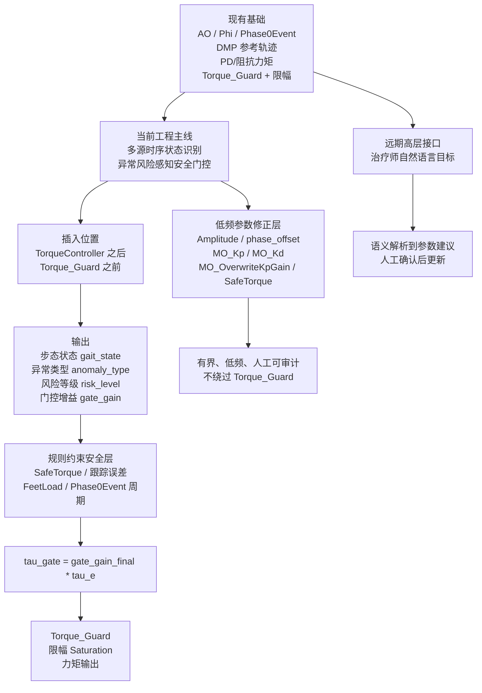
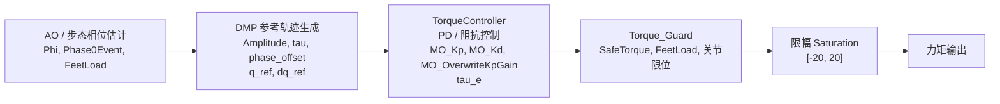
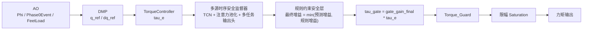
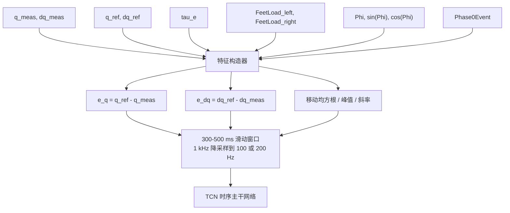
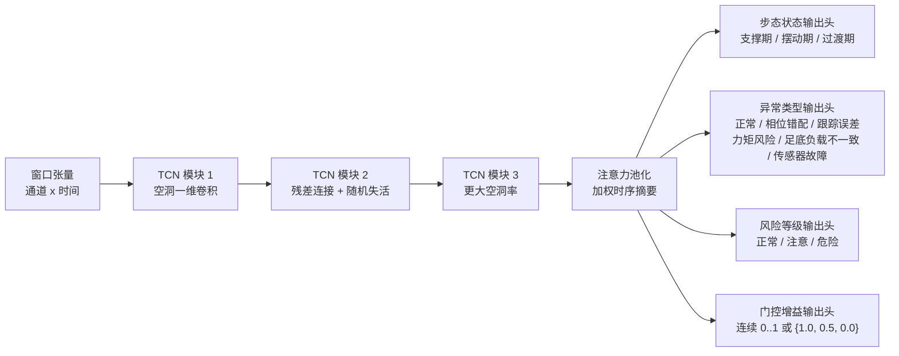
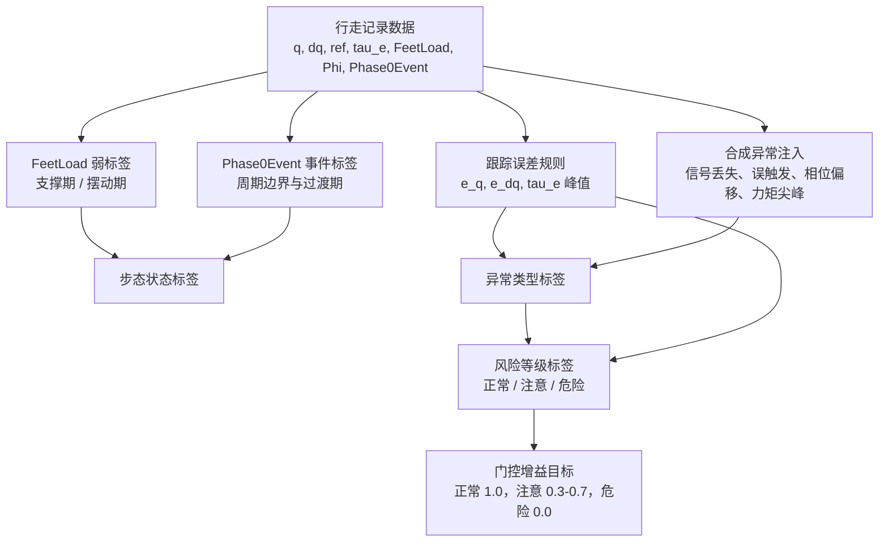
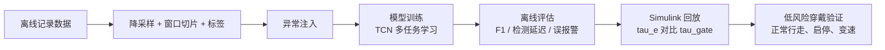
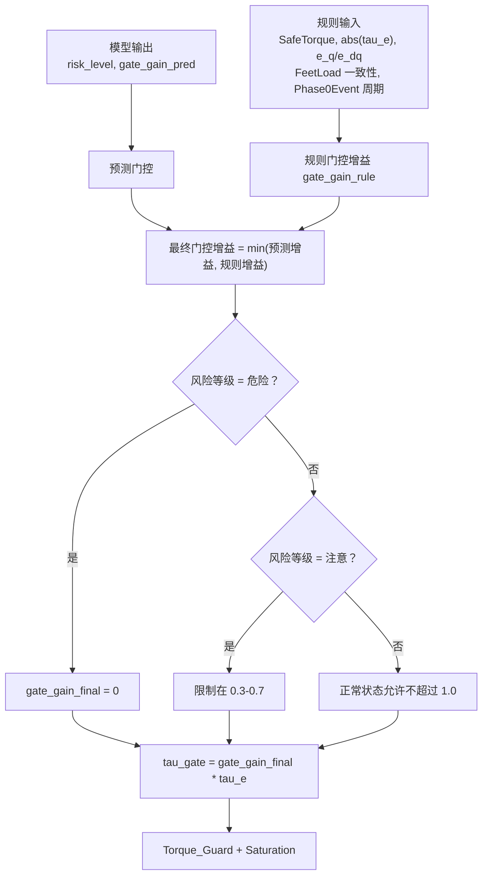
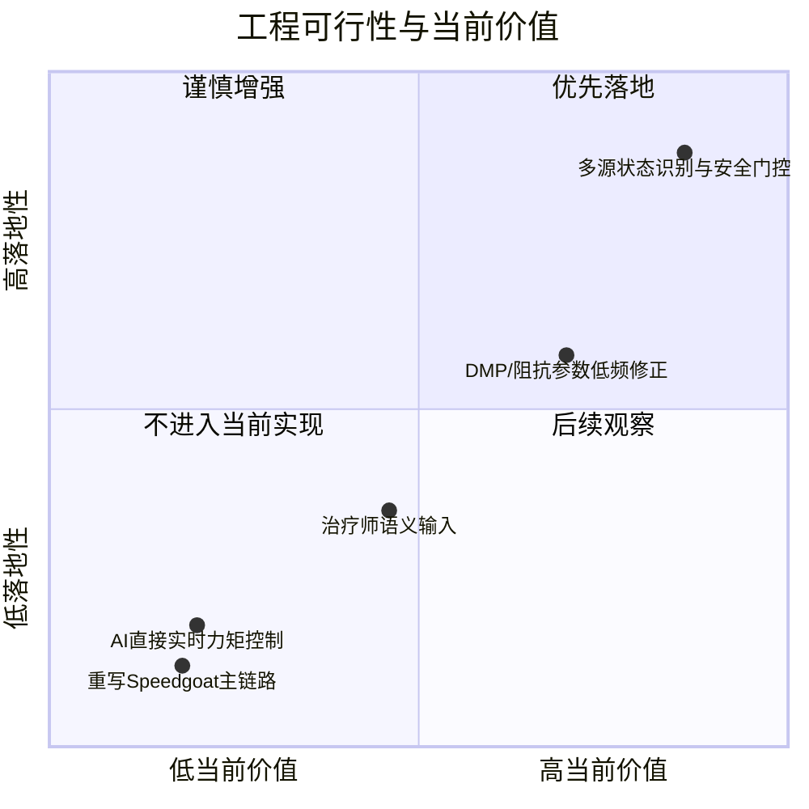
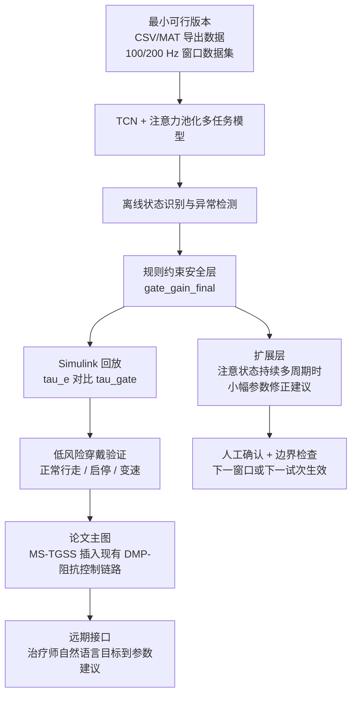

# MS-TGSS 技术路线可视化看板

看板说明与结论

系统名称：**面向 DMP-阻抗膝关节外骨骼的多源时序步态状态与安全监督器**

简称：**MS-TGSS / MT-GSS**

结论：当前工程主线合并为“多源时序步态状态识别 + 异常风险感知安全门控 + 低频有界参数修正”。语义/治疗师自然语言输入单独放在远期高层接口，不进入当前实现。

资料依据：`research_routes.md`、`light_screening_report.md`、`top_10_for_deep_reading.md`、`InterForceControlTask_parameter_report.md`、`light_rank_top30.csv`。本看板只使用压缩资料和参数报告，不继续大规模精读 PDF。

## 1. 总体路线决策

## 2. 现有控制链路

## 3. 新增 AI 模块插入位置

## 4. 多源输入信号

## 5. TCN + 注意力池化 + 多任务输出模型结构

## 6. 标签生成流程

## 7. 实验验证流程

## 8. 安全门控逻辑

9. 可行性对比矩阵

| 方向 | 当前实现位置 | 1-2 个月落地性 | 主要输出 | 本阶段处理方式 |
|---|---|---:|---|---|
| 多源状态识别与安全门控 | TorqueController 与 Torque_Guard 之间 | 高 | `gait_state`, `anomaly_type`, `risk_level`, `gate_gain` | 主线实现 |
| DMP/阻抗参数低频修正 | 步态周期级或试次级参数入口 | 中 | `Amplitude`, `phase_offset`, `MO_Kp`, `MO_Kd`, `SafeTorque` 的小幅建议 | 作为同一系统的扩展层 |
| 治疗师语义输入 | Speedgoat 外层人机交互入口 | 低到中 | 受限参数建议 | 单独放远期接口 |
| AI 直接实时力矩控制 | 替代 TorqueController | 低 | torque command | 不做 |
| 重写 Speedgoat 主链路 | AO/DMP/控制器整体替换 | 低 | 新控制架构 | 不做 |

10. 最终推荐技术路线

四类实验

**实验 A：离线状态识别实验**

正常行走数据，识别支撑期、摆动期、过渡期。指标：准确率、宏平均 F1、混淆矩阵。

**实验 B：异常注入检测实验**

注入 FeetLoad 信号丢失、Phase0Event 丢失或误触发、Phi 相位偏移、`q_ref / q_meas` 跟踪错配、`tau_e` 力矩尖峰。指标：精确率、召回率、F1、误报警率、检测延迟。

**实验 C：Simulink 回放安全门控实验**

对比原始 `tau_e` 和 `tau_gate`。指标：峰值力矩降低量、门控响应延迟、正常状态力矩保留率。

**实验 D：低风险健康受试者穿戴验证**

正常行走、启停、变速，不做人为危险扰动。指标：`gate_gain` 正常保持率、误触发率、RMSE/PCC 是否明显劣化、交互力矩是否平滑。

最先看哪一张

先看“新增 AI 模块插入位置”和“安全门控逻辑”。这两张最直接说明本方案不替代原控制器、不直接输出实时力矩，而是在 `TorqueController` 和 `Torque_Guard` 之间增加可回放、可约束、可验证的安全监督层。

