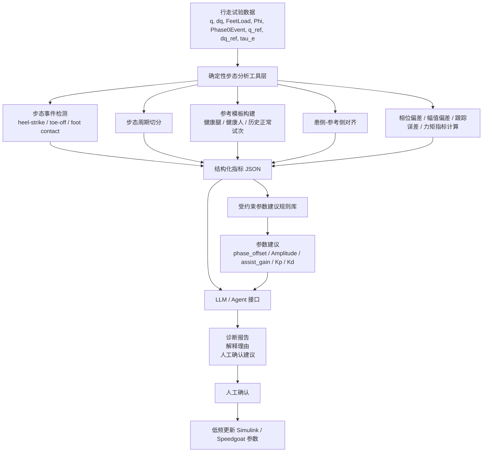

# 工具增强型膝关节外骨骼步态分析与参数建议路线图

## 0. 一句话定位

本文不做 LLM 自主控制外骨骼，也不让 LLM 直接生成电机力矩，而是构建一个面向穿戴膝关节外骨骼直线行走任务的工具增强型步态分析与参数建议框架：通过确定性工具完成步态事件检测、周期切分、患侧-参考侧对齐、相位/幅值/力矩偏差计算，再由受约束规则库生成低频参数建议，LLM 仅作为工具编排、结果解释和报告生成接口。

------

## 1. 场景与需求

### 1.1 应用场景

患者或健康受试者穿戴准直驱膝关节外骨骼，在治疗师或工程师监督下完成一段直线行走任务。

典型流程包括：

```text
站立准备
→ 开始行走
→ 前几步步态启动
→ 稳定直线行走
→ 到达终点
→ 手动关闭助力或停止运行
```

系统记录行走过程中的多源信号，用于分析患侧步态状态、患侧与参考侧之间的差异，以及当前 DMP/助力参数是否需要调整。

------

## 2. 为什么不直接训练状态识别模型

当前不优先采用 TCN/Transformer 等监督学习模型作为主线，原因包括：

1. 步态状态标签需要逐段或逐帧标注，打标成本高。
2. 可采集受试者数量有限，难以支撑泛化能力强的模型训练。
3. 模型输出的状态标签本身不一定能直接转化为有效参数调整。
4. 深度模型结果解释困难，后续很难说服老师或审稿人其参数建议可靠。
5. 若模型只输出“是否开启助力”，论文贡献会显得过弱。

因此，本文优先采用确定性工具链完成步态分析，再使用受约束参数建议逻辑生成可解释建议。

------

## 3. 为什么不做 LLM 实时控制

本文不将 LLM 放入实时控制闭环，原因包括：

1. LLM 存在幻觉风险。
2. LLM 输出不具备实时性保证。
3. LLM 难以直接处理 1 kHz 高频原始传感器序列。
4. LLM 自由生成参数建议不可验证。
5. 外骨骼控制涉及人机安全，不应让 LLM 直接写入控制量或绕过底层安全链路。

因此，LLM 只作为低频分析接口：

```text
工具计算结果
→ 结构化指标 JSON
→ LLM 解释与报告生成
→ 人工确认
→ 低频参数调整
```

------

## 4. 总体技术路线



------

## 5. 系统分层

### 5.1 数据层

输入信号包括：

```text
q_meas：膝关节实际角度
dq_meas：膝关节实际角速度
q_ref：DMP 参考角度
dq_ref：DMP 参考角速度
FeetLoad_left / FeetLoad_right：左右足底压力或足底负载
Phi：AO/DMP 相位
Phase0Event：步态事件或周期边界
tau_e：控制器期望输出力矩
manual_enable：人工允许助力信号
manual_disable：人工关闭信号
affected_side：患侧信息
```

------

### 5.2 工具层

工具层由确定性 Python/MATLAB 函数组成，不依赖 LLM 自由判断。

建议实现的核心工具包括：

```text
detect_gait_events()
segment_gait_cycles()
build_reference_template()
align_affected_to_reference()
compute_phase_error()
compute_amplitude_error()
compute_tracking_error()
compute_interaction_torque_index()
check_signal_reliability()
suggest_parameter_adjustment()
generate_trial_summary()
```

------

### 5.3 指标层

工具层输出结构化指标，例如：

```json
{
  "trial_id": "T001",
  "affected_side": "right",
  "num_valid_cycles": 8,
  "phase_delay_ratio": 0.12,
  "phase_delay_ms": 135,
  "affected_peak_flexion_error_deg": -6.8,
  "tracking_rmse_deg": 7.5,
  "torque_peak_nm": 16.2,
  "safe_torque_nm": 20.0,
  "torque_peak_ratio": 0.81,
  "foot_contact_reliability": "good",
  "phase_reliability": "medium",
  "data_quality": "usable"
}
```

LLM 不直接读取高频原始数据，而是读取这些压缩后的结构化指标。

------

### 5.4 参数建议层

参数建议不由 LLM 自由生成，而由受约束规则库生成。

建议空间限制为：

```text
phase_offset：小幅提前 / 小幅延后 / 保持
Amplitude：小幅增大 / 小幅减小 / 保持
assist_gain：小幅增大 / 小幅减小 / 保持
MO_Kp：小幅增大 / 保持
MO_Kd：小幅增大 / 保持
SafeTorque：原则上不主动增大
```

示例规则：

```text
若患侧助力相位晚于参考超过阈值：
    建议 phase_offset 小幅提前

若患侧膝屈曲峰值低于参考超过阈值，且 tau_e 未接近限幅：
    建议 Amplitude 或 assist_gain 小幅增大

若跟踪误差较大，且 tau_e 未接近 SafeTorque：
    可考虑小幅增加 Kp 或助力增益

若 tau_e 接近 SafeTorque：
    禁止增加 Amplitude、assist_gain 或 Kp

若足底压力事件不可靠：
    不输出参数建议，仅提示重新采集或检查传感器

若相位估计不可靠：
    不建议调整 phase_offset
```

------

### 5.5 LLM / Agent 层

LLM 的职责：

```text
1. 按固定流程调用工具
2. 读取工具输出的 JSON 指标
3. 根据规则库结果组织诊断说明
4. 生成工程师/治疗师可读报告
5. 回答“为什么建议这样调”的问题
```

LLM 不做：

```text
1. 不直接输出电机力矩
2. 不直接修改 Simulink 参数
3. 不绕过 Torque_Guard
4. 不根据自由推理生成未知参数
5. 不直接处理 1 kHz 原始长序列
6. 不替代底层 AO、DMP、TorqueController
```

------

## 6. 参数建议逻辑

### 6.1 相位类问题

目标：判断患侧助力介入是否偏早或偏晚。

输入指标：

```text
患侧事件时间
参考侧事件时间
Phase0Event
Phi
time_to_assist_event
phase_delay_ms
phase_delay_ratio
```

建议逻辑：

```text
phase_delay_ratio > threshold_late:
    建议 phase_offset 提前

phase_delay_ratio < threshold_early:
    建议 phase_offset 延后

phase_reliability == low:
    不建议调整 phase_offset
```

------

### 6.2 幅值类问题

目标：判断患侧膝关节屈伸幅度是否不足或过大。

输入指标：

```text
affected_peak_flexion
reference_peak_flexion
peak_flexion_error
DMP Amplitude
tau_e
SafeTorque
```

建议逻辑：

```text
peak_flexion_error < -threshold 且 tau_e 未接近 SafeTorque:
    建议 Amplitude 或 assist_gain 小幅增大

peak_flexion_error > threshold:
    建议 Amplitude 或 assist_gain 小幅减小

tau_e 接近 SafeTorque:
    禁止增大 Amplitude 或 assist_gain
```

------

### 6.3 跟踪误差类问题

目标：判断当前 DMP 参考轨迹与实际患侧运动之间的偏差。

输入指标：

```text
q_ref - q_meas
dq_ref - dq_meas
tracking_rmse
tau_e
SafeTorque
```

建议逻辑：

```text
tracking_rmse 较大 且 tau_e 未接近限幅:
    可建议小幅增加 Kp 或 assist_gain

tracking_rmse 较大 且 tau_e 接近限幅:
    不建议继续提高增益，应检查参考轨迹或传感器可靠性

tracking_rmse 较小:
    保持当前参数
```

------

### 6.4 力矩约束类问题

目标：防止参数建议导致力矩过大。

输入指标：

```text
tau_e_peak
tau_e_rms
SafeTorque
Torque_Guard 触发次数
Saturation 触发次数
```

建议逻辑：

```text
tau_e_peak / SafeTorque > 0.85:
    禁止增大助力相关参数

Torque_Guard 频繁触发:
    建议降低 assist_gain 或保持参数不变

Saturation 频繁触发:
    不建议提高 Kp、Amplitude 或 assist_gain
```

------

## 7. 参考来源设计

参考可以来自三类数据：

### 7.1 健康受试者参考模板

健康人完成相同直线行走任务，构建标准参考模板。

优点：

```text
容易采集
数据稳定
适合工程验证
```

缺点：

```text
与偏瘫患者个体差异较大
不能直接作为临床最优目标
```

------

### 7.2 患者健康腿参考

使用患者健康侧腿作为个体化参考。

优点：

```text
更符合个体化调参逻辑
能够体现左右侧差异
```

缺点：

```text
左右腿不是简单镜像
偏瘫患者健康侧也可能存在代偿
```

------

### 7.3 历史较优试次参考

使用同一受试者历史表现较好的试次作为参考。

优点：

```text
个体一致性更强
适合参数迭代
```

缺点：

```text
需要多次试验积累
初次使用时不可用
```

------

## 8. 实验设计

### 实验 A：工具层有效性验证

目的：验证事件检测、周期切分和偏差计算是否可靠。

数据：

```text
健康受试者或已有穿戴数据
每人多次直线行走试验
```

指标：

```text
步态事件检测准确率
事件检测延迟
周期切分成功率
人工检查一致性
```

------

### 实验 B：参考对齐与偏差分析验证

目的：验证系统能否识别患侧与参考之间的差异。

方法：

```text
构建健康腿或健康人参考模板
将患侧数据相位归一化
计算相位偏差、幅值偏差、跟踪误差
```

指标：

```text
phase_delay_ms
phase_delay_ratio
peak_flexion_error_deg
tracking_rmse_deg
左右侧对称性指标
```

------

### 实验 C：参数建议一致性验证

目的：验证系统建议是否符合规则库和专家判断。

方法：

```text
准备多组典型场景：
1. 患侧相位偏晚
2. 患侧相位偏早
3. 患侧膝屈曲不足
4. 跟踪误差大但力矩未饱和
5. 力矩接近限幅
6. 足底压力信号不可靠
```

指标：

```text
建议一致率
错误建议率
保守拒绝率
约束违反率
```

------

### 实验 D：LLM 报告可靠性验证

目的：验证 LLM 是否忠实于工具输出和规则库结果。

方法：

```text
固定同一批工具输出 JSON
使用 LLM 生成诊断报告
人工检查报告是否存在无依据结论
```

指标：

```text
JSON 格式正确率
规则遵守率
unsupported claim 数量
约束违反率
报告可读性评分
```

------

### 实验 E：Simulink 回放验证

目的：验证参数建议是否能在离线回放中改善指标。

方法：

```text
使用原始参数回放
使用建议参数回放
比较调整前后结果
```

指标：

```text
相位偏差是否下降
幅值偏差是否下降
跟踪 RMSE 是否下降
tau_e 是否未超过 SafeTorque
Torque_Guard 是否未频繁触发
Saturation 是否未明显增加
```

------

## 9. 评价指标

### 9.1 工具层指标

```text
事件检测准确率
事件检测延迟
周期切分成功率
相位偏差计算稳定性
幅值偏差计算稳定性
```

------

### 9.2 参数建议指标

```text
建议一致率
错误建议率
保守拒绝率
参数边界违反率
安全约束违反率
```

------

### 9.3 LLM 输出指标

```text
格式正确率
规则遵守率
unsupported claim rate
幻觉率
报告完整性
```

------

### 9.4 控制回放指标

```text
tracking RMSE
phase error
peak flexion error
tau_e peak
tau_e RMS
Torque_Guard 触发次数
Saturation 触发次数
```

------

## 10. 不做的内容

当前阶段明确不做：

```text
1. 不做 LLM 实时控制
2. 不做 LLM 直接输出力矩
3. 不做多 Agent 系统
4. 不做开放式 RAG 检索
5. 不做大规模患者数据训练
6. 不做端到端深度学习控制器
7. 不重写 Speedgoat/Simulink 主控制链路
8. 不让 LLM 自动写入参数
9. 不把聊天记忆作为系统记忆
10. 不声称临床疗效
```

------

## 11. 为什么暂时不做 Multi-Agent

当前任务不需要 Multi-Agent。

原因：

```text
1. 单 Agent + 多工具已经足够完成流程
2. 多 Agent 会增加上下文传递和冲突处理问题
3. 多 Agent 难以评估
4. 多 Agent 会增加幻觉和不稳定性
5. 当前论文重点应放在工具链、参数建议和回放验证上
```

可替代说法：

```text
本文采用模块化工具链，而非多 Agent 架构。
```

------

## 12. 为什么不使用 LLM 记忆系统

本文不依赖 LLM 隐式记忆。

历史信息应保存为结构化文件：

```text
patient_profile.json
trial_summary.json
reference_template.csv
parameter_history.csv
```

原因：

```text
1. 可追溯
2. 可复现
3. 可审计
4. 不依赖模型内部状态
5. 方便实验对比
```

如果需要历史试次比较，可以通过数据库或结构化文件读取，而不是依赖聊天记忆。

------

## 13. 上下文控制策略

LLM 不读取原始长序列数据。

采用：

```text
原始 CSV/MAT 数据
→ 工具处理
→ 指标 JSON
→ LLM 解释
```

LLM 上下文中只包含：

```text
1. 当前试次摘要
2. 关键指标
3. 参数边界
4. 规则库结果
5. 历史参数变化摘要
```

这样可以避免上下文爆炸。

------

## 14. 可发表性的关键点

这条路线能否发表，不取决于 Agent 名字是否新，而取决于：

```text
1. 步态分析工具是否可靠
2. 偏差指标是否有物理意义
3. 参数建议规则是否合理
4. LLM 是否被约束在可审计范围内
5. Simulink 回放是否显示建议有效
6. 报告是否忠实于工具输出
```

论文不能押注在：

```text
Agent 很聪明
LLM 能理解步态
LLM 能自动调参
```

论文应该押注在：

```text
工具算得准
规则有约束
建议可解释
报告可审计
回放有效
```

------

## 15. 推荐论文题目

### 稳妥版

穿戴膝关节外骨骼条件下的偏瘫步态分析与助力参数建议方法

### 带工具增强版

基于工具增强分析框架的膝关节外骨骼步态评估与参数建议方法

### 带 Agent 版

面向膝关节外骨骼参数整定的工具增强型步态分析 Agent 方法

### 更贴近 DMP 版

基于工具增强 Agent 的膝关节外骨骼步态分析与 DMP 参数建议方法

------

## 16. 预期贡献

本文贡献可以概括为：

```text
1. 构建了面向穿戴膝关节外骨骼直线行走任务的多源步态分析工具链，实现步态事件检测、周期切分、患侧-参考侧对齐和偏差指标计算。

2. 提出了基于相位偏差、幅值偏差、跟踪误差和力矩约束的 DMP/助力参数建议规则，实现低频、可解释、受限的参数调整建议。

3. 设计了工具增强型分析接口，将步态分析工具、参数建议规则和报告生成过程组织为可审计流程，为外骨骼临床试穿后的参数调试提供辅助。
```

------

## 17. 最小可行实现计划

### 第 1 周：数据与工具框架

```text
整理已有数据格式
导出 q, dq, q_ref, dq_ref, FeetLoad, Phi, Phase0Event, tau_e
编写数据读取脚本
实现基础可视化
```

------

### 第 2 周：事件检测与周期切分

```text
实现足底压力事件检测
实现 Phase0Event 辅助切分
实现步态周期归一化
输出每个周期的关键事件时间
```

------

### 第 3 周：参考对齐与偏差指标

```text
构建健康腿/健康人参考模板
实现患侧-参考侧相位对齐
计算相位偏差
计算幅值偏差
计算跟踪误差
计算力矩指标
```

------

### 第 4 周：参数建议规则库

```text
设计 phase_offset 建议规则
设计 Amplitude 建议规则
设计 assist_gain 建议规则
设计 Kp/Kd 建议规则
加入 SafeTorque 与数据可靠性约束
输出 parameter_suggestion.json
```

------

### 第 5 周：LLM/Agent 接口与报告生成

```text
设计固定工具调用流程
让 LLM 读取 trial_summary.json 和 parameter_suggestion.json
生成诊断报告
检查 unsupported claim
限制 LLM 输出格式
```

------

### 第 6 周：Simulink 回放与论文材料

```text
根据建议参数进行离线回放
比较调整前后指标
整理图表
形成方法框图
整理实验结果
撰写论文方法和实验部分
```

------

## 18. 最终系统边界

本文系统边界如下：

```text
Agent 可以：
- 调用工具
- 汇总指标
- 解释结果
- 生成报告
- 给出受约束参数建议

Agent 不可以：
- 直接输出力矩
- 直接修改 Speedgoat 参数
- 自由创造参数
- 绕过安全限制
- 替代底层控制器
```

------

## 19. 最终口径

最终对外表述建议：

本文面向穿戴膝关节外骨骼的直线行走任务，提出一种工具增强型步态分析与参数建议方法。该方法不将 LLM 置于实时控制闭环，而是通过确定性工具完成步态事件检测、周期切分、参考对齐、相位/幅值/力矩偏差分析，并基于受约束规则库生成 DMP 和助力参数的低频调整建议。LLM 仅作为工具编排和报告生成接口，用于提高参数调试过程的可解释性和可审计性。最终参数更新需经人工确认，并由原有 Speedgoat/Simulink 控制链路执行。